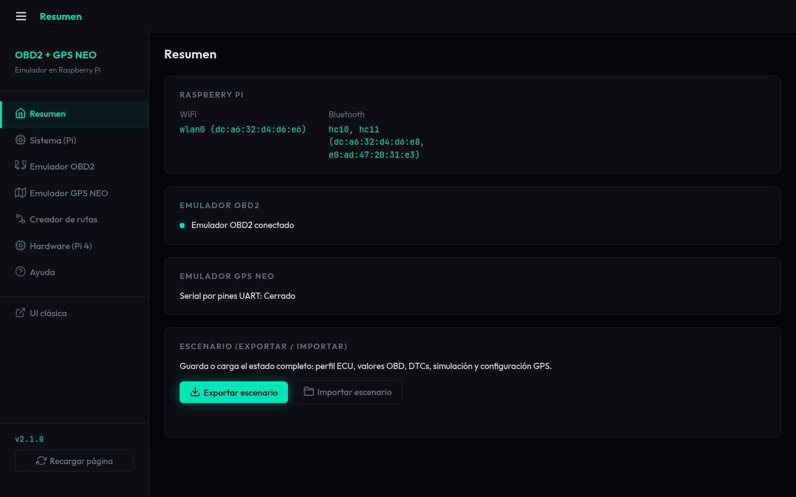
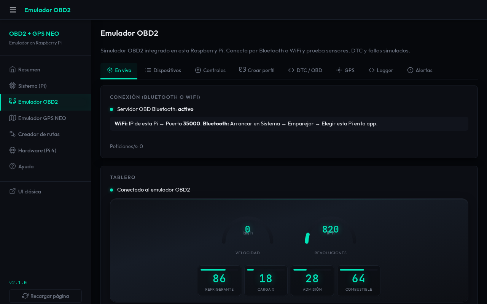
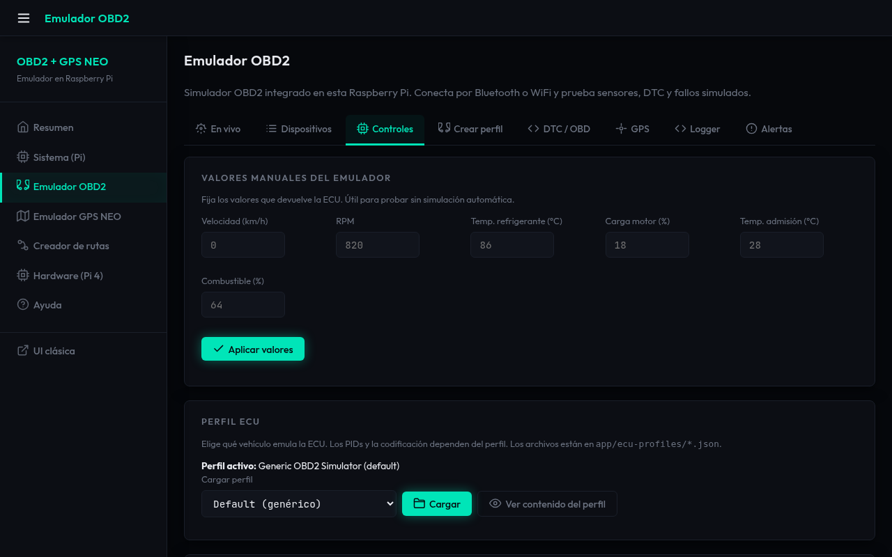
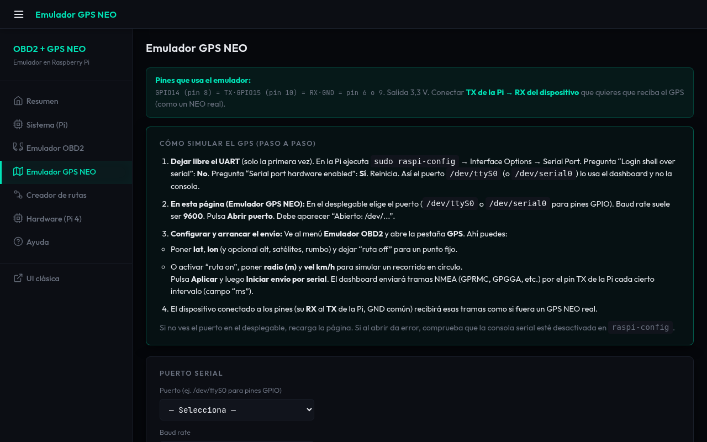
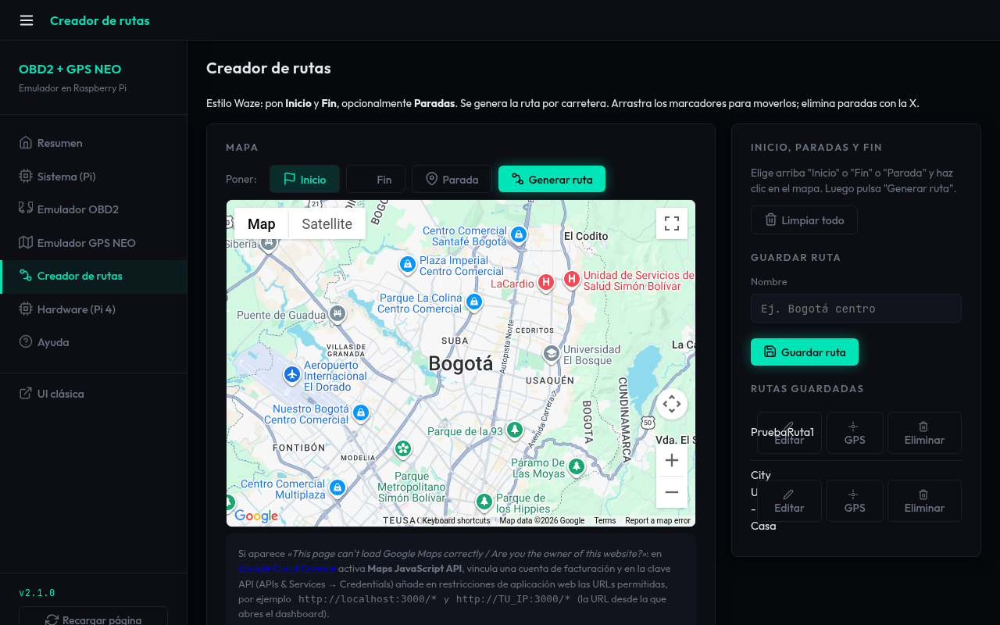
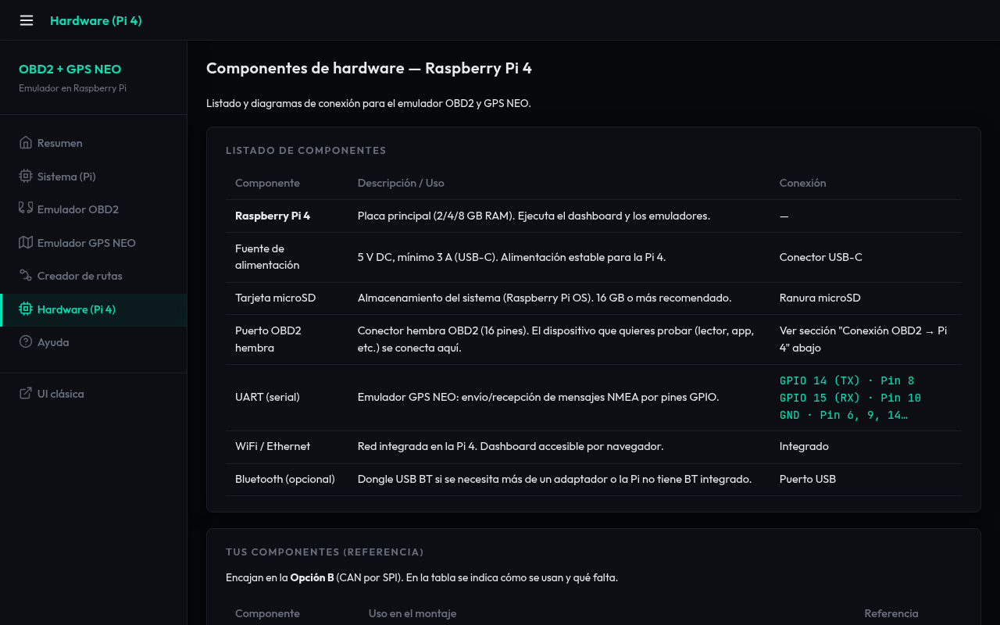

# 🚗 Simulador ECU — OBD2 + GPS NEO

> **Una Raspberry Pi que se comporta como la ECU de tu auto y como un GPS.**  
> Conecta Torque (o cualquier app OBD2), dibuja rutas en el mapa, emula sensores en vivo y envía NMEA por UART. Todo desde un solo dashboard en el navegador.

[](#plataforma) [](#plataforma) [](#requisitos)

---

## ¿Para qué sirve?

¿Desarrollas apps para autos, pruebas dispositivos OBD2 o quieres simular un viaje con GPS sin moverte? Este proyecto convierte una **Raspberry Pi** en:

| Qué emula | Cómo te conectas | Qué ves en el dashboard |
|-----------|------------------|-------------------------|
| **ECU OBD2** (ELM327) | WiFi (puerto 35000), **Bluetooth** o CAN (SocketCAN) | Velocidad, RPM, temperatura, DTC, perfiles de vehículo, simulación de conducción |
| **GPS NEO** (NMEA) | UART (GPIO 14 TX) | Punto fijo, ruta circular o rutas guardadas; tramas GPGGA/GPRMC en tiempo real |
| **Rutas reales** | Creador integrado | Dibujas inicio/fin en el mapa, generas la ruta por carretera y la reproduces en el emulador GPS |

Todo se controla desde **una sola interfaz web** en tu red (PC, tablet o móvil): sin instalar nada en el celular más que la app OBD2 que ya usas.

---

## Así se ve el dashboard

La interfaz incluye **Resumen**, **Sistema (Pi)**, **Emulador OBD2**, **Emulador GPS NEO**, **Creador de rutas** y una sección de **Ayuda** con capturas paso a paso.

### Menú y resumen

En la izquierda está el menú; el **Resumen** muestra el estado de la Pi, del emulador OBD2 y del GPS, más la tarjeta **Escenario** para exportar e importar la configuración completa.




### Emulador OBD2 — En vivo y controles

Cuadro de mandos en tiempo real (velocidad, RPM, temperatura, carga, combustible), pestañas para **Dispositivos**, **Controles** (valores manuales, simulador de conducción, fallos), **Crear perfil**, **DTC**, **GPS** y **Logger**.






### Emulador GPS NEO

Selección de puerto serial y baud rate, **Abrir puerto**, y en la misma página la configuración de posición/ruta y **Iniciar envío por serial**. Las tramas NMEA salen por el UART de la Pi.



### Creador de rutas

Inicio, fin y paradas en el mapa; **Generar ruta** por carretera y **Guardar ruta** para usarla en el emulador GPS. Requiere `GOOGLE_MAPS_API_KEY` en `.env`.



### Hardware (Pi 4)

Referencia de componentes, conector OBD2, MCP2515, pines GPIO y scripts para levantar el bus CAN (`can0`).



---

## Uso en 4 pasos

1. **OBD2 por WiFi** — En Torque (o similar), conecta a la **IP de la Pi**, puerto **35000**. Celular y Pi en la misma red.
2. **OBD2 por Bluetooth** — En el dashboard: **Sistema (Pi)** → elige adaptador BT → **Arrancar / Hacer visible** → empareja el celular y selecciona la Pi en la app.
3. **GPS por UART** — En **Emulador GPS NEO** abre el puerto (p. ej. `/dev/serial0`). En **OBD2 → GPS** configura posición o ruta, **Aplicar** e **Iniciar envío por serial**.
4. **Rutas** — En **Creador de rutas** dibuja la ruta, guárdala y cárgala en el emulador GPS para reproducirla.

Dentro del dashboard, la sección **Ayuda** tiene más capturas y solución de problemas (conexión, Bluetooth, mapa que no carga, etc.).

---

## Instalación rápida

```bash
git clone https://github.com/WilmarC20/SimuladorEcu.git
cd SimuladorEcu/app
npm install
cp ../.env.example ../.env
# Opcional: edita ../.env y añade GOOGLE_MAPS_API_KEY para mapas
npm start
```

Abre en el navegador: `http://<IP-de-tu-Pi>:3000` (o `http://localhost:3000` en la misma máquina).

---

## Configuración (.env)

| Variable | Descripción |
|----------|-------------|
| `HTTP_PORT` | Puerto del dashboard (por defecto 3000) |
| `OBD_TCP_PORT` | Puerto TCP del emulador OBD2 (por defecto 35000) |
| `GOOGLE_MAPS_API_KEY` | Clave de Google Maps (Creador de rutas y mapas) |
| `GOOGLE_MAPS_MAP_ID` | Map ID opcional para estilos |

Copia `.env.example` a `.env` y no subas `.env` al repositorio.

---

## Plataforma y requisitos

- **Raspberry Pi 4** (2/4/8 GB): probado y recomendado.
- **Raspberry Pi Zero / Zero 2 W**: soportado (menor carga; CAN opcional o uso ligero).
- **Node.js** ≥ 18, **Raspberry Pi OS** (o compatible). UART habilitado si usas el emulador GPS por pines. Opcional: SocketCAN y bus `can0` para OBD2 por CAN.

---

## Estructura del repositorio

```
├── app/                 # Servidor Node.js y frontend (dashboard)
│   ├── index.js         # Entrada del servidor
│   ├── public/          # HTML, CSS, JS e imágenes (incl. ayuda)
│   ├── lib/             # Motor OBD2, GPS, CAN, Bluetooth
│   ├── routes/         # Rutas API (/api/*)
│   └── data/            # Rutas guardadas (routes.json)
├── docs/                # Documentación hardware (Pi, CAN, OBD2)
├── scripts/             # Scripts CAN (can0-up, ensure-can0-boot)
├── deploy/              # Servicio systemd de ejemplo
└── .env.example         # Plantilla de variables de entorno
```

La carpeta **Tracker360** (firmware u otro código externo) no forma parte de este repo.

---

## Repositorio

**[GitHub — WilmarC20/SimuladorEcu](https://github.com/WilmarC20/SimuladorEcu)**

Proyecto de código abierto. Para reportar fallos o contribuir, usa los *issues* y *pull requests* del repositorio.
